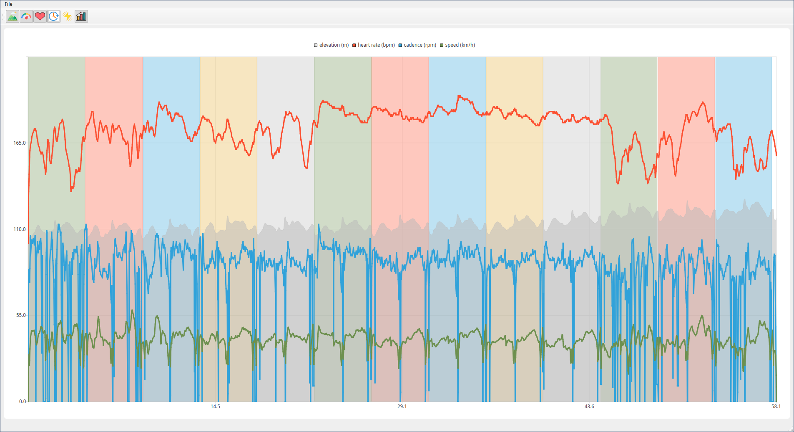

## About
LapAnalyzer is a tool to analyze race laps from FIT file.

## Supported features
- [x] FIT parsing
- [x] laps auto-detection
- [x] heart rate, speed, elevation, cadence and power interactive plotting
- [ ] lap statistics
- [ ] screenshots summary exportation

## Screenshot

